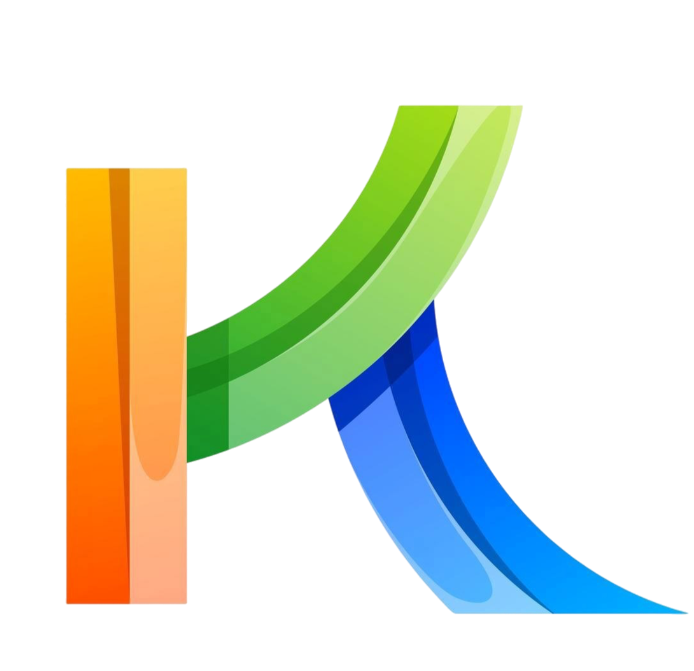

<p align="center">
  
</p>

<h1 align="center">Kikiriya DevOps</h1>

<p align="center">
  <strong>Sitio web profesional — Desarrollo de Software y Diseño Web</strong>
</p>

<p align="center">
  <a href="https://kikiriya-devops.netlify.app/" target="_blank">
    
  </a>
  
  
  
  
</p>

---

## Descripcion

**Kikiriya DevOps** es un estudio de desarrollo web especializado en crear sitios accesibles, minimalistas y optimizados para buscadores. Combinamos diseno moderno con tecnologia limpia para ofrecer experiencias digitales que convierten visitantes en clientes.

Cada proyecto se construye pensando en la experiencia del usuario, el rendimiento y la accesibilidad, garantizando un resultado elegante, rapido y funcional en cualquier dispositivo.

## Live Demo

> **[kikiriya-devops.netlify.app](https://kikiriya-devops.netlify.app/)**

---

## Caracteristicas

- **Diseno Minimalista** — Estetica moderna, limpia y con proposito
- **100% Responsive** — Mobile First, 4 breakpoints (480px, 768px, 900px, 1200px)
- **Tema Dark/Light** — Toggle con persistencia en localStorage y respeto por preferencias del sistema
- **Bilingue ES/EN** — Cambio de idioma instantaneo en todo el sitio
- **Animacion Tipewriter** — Texto animado tipo maquina de escribir en el hero
- **SEO Optimizado** — Meta tags, Open Graph, Twitter Cards, canonical, hreflang, JSON-LD preparado
- **Accesibilidad (WCAG)** — Skip-link, aria-labels, aria-hidden en emojis decorativos, prefers-reduced-motion
- **WhatsApp Integrado** — Boton flotante con mensaje pre-llenado
- **Google Fonts Optimizado** — Preconnect + subset de pesos (400-700)
- **CSS Custom Properties** — Variables para colores, sombras, fuentes y transiciones
- **Sin dependencias externas** — JavaScript vanilla, sin frameworks ni librerias

---

## Tecnologias

| Tecnologia | Uso |
|------------|-----|
| **HTML5** | Estructura semantica con landmarks, ARIA roles y meta tags SEO |
| **CSS3** | Custom Properties, Grid, Flexbox, animations, clamp(), media queries |
| **JavaScript** | Vanilla JS — tema, idioma, reloj, tipewriter, sin bundlers |
| **Google Fonts** | Poppins, Playfair Display, Comfortaa |
| **Flaticon UIcons** | Iconografia regular rounded |
| **Netlify** | Hosting y deploy automatico via Git |

---

## Estructura del Proyecto

```
kikiriya-devops/
├── index.html                  # Sitio completo (HTML + CSS + JS)
├── logoKiki.png                # Logo principal
├── logoKiki-min.png            # Logo optimizado (favicon + og:image)
├── kikiriya-software.png       # Asset del proyecto
├── kikiriyaLogo.png            # Variante del logo
├── diseno-logotipo-icono-...   # Icono de la marca
├── fondo.png                   # Imagen de fondo
├── unFondo1.jpg                # Variante de fondo
├── 72833147_143.jpg            # Asset adicional
└── README.md                   # Este archivo
```

---

## Como Desplegar

### Opcion 1: Netlify (recomendado)

1. Subir el repositorio a GitHub
2. Conectar el repositorio en [Netlify](https://app.netlify.com)
3. Configurar:
   - **Build command:** (vacio — es un sitio estatico)
   - **Publish directory:** `.` o `/`
4. Deploy automatico en cada push a `master`

### Opcion 2: Cualquier hosting estatico

1. Copiar todos los archivos a la raiz del hosting
2. Asegurarse de que `index.html` este en la carpeta principal
3. No se requiere build ni instalacion de dependencias

---

## Contacto

| Canal | Informacion |
|-------|-------------|
| **Email** | [kikiriyadevops@gmail.com](mailto:kikiriyadevops@gmail.com) |
| **WhatsApp** | [+598 94 872 605](https://wa.me/598094872605) |
| **Ubicacion** | Capurro, Montevideo, Uruguay |
| **GitHub** | [@DorilaDevOps](https://github.com/DorilaDevOps) |
| **Sitio Web** | [kikiriya-devops.netlify.app](https://kikiriya-devops.netlify.app/) |

---

## Licencia

Este proyecto esta bajo la licencia MIT. Ver el archivo [LICENSE](LICENSE) para mas detalles.
